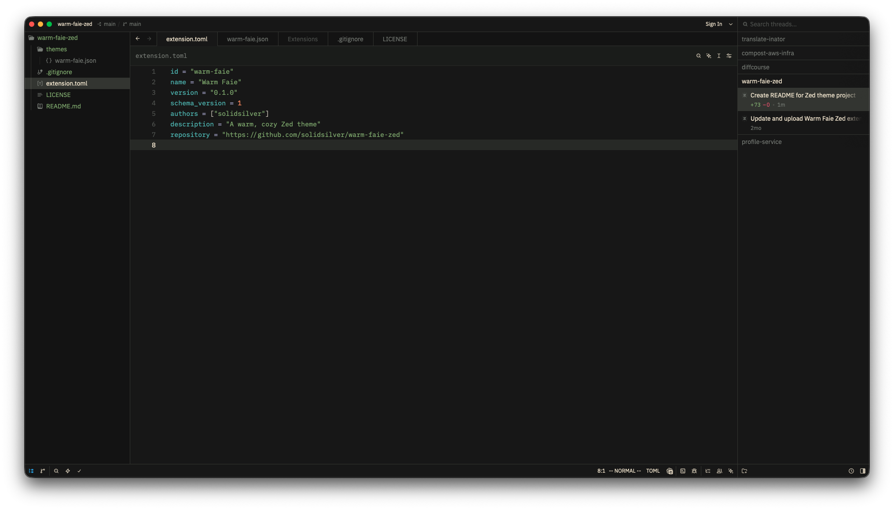
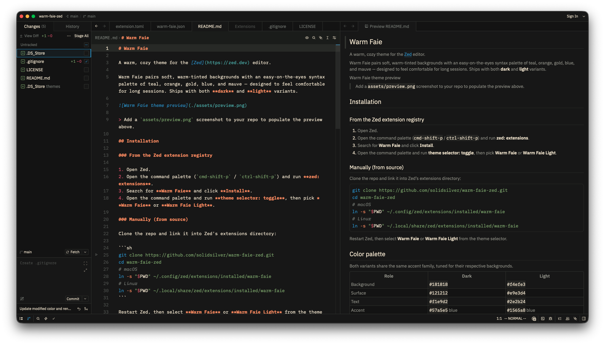
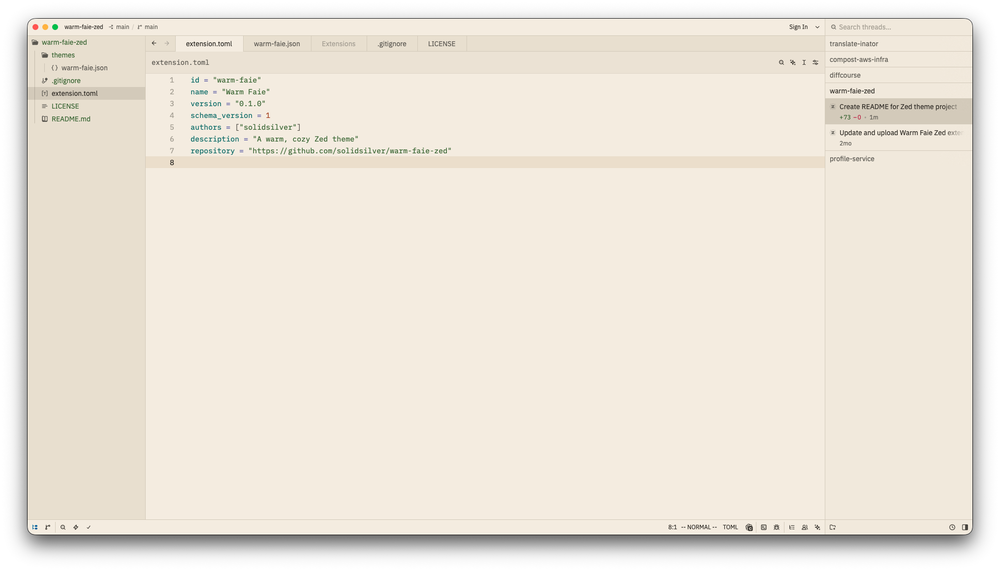
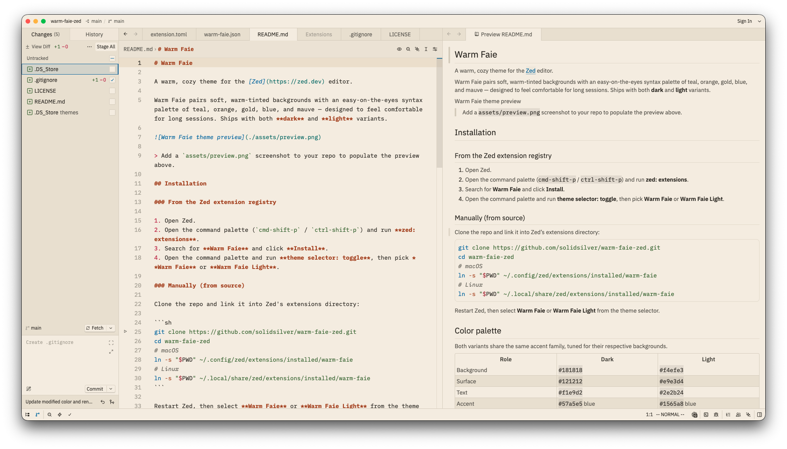

# Warm Faie

A warm, cozy theme for the [Zed](https://zed.dev) editor.

Warm Faie pairs soft, warm-tinted backgrounds with an easy-on-the-eyes syntax palette of teal, orange, gold, blue, and mauve — designed to feel comfortable for long sessions. Ships with both **dark** and **light** variants.

### Dark




### Light




## Installation

### From the Zed extension registry

1. Open Zed.
2. Open the command palette (`cmd-shift-p` / `ctrl-shift-p`) and run **zed: extensions**.
3. Search for **Warm Faie** and click **Install**.
4. Open the command palette and run **theme selector: toggle**, then pick **Warm Faie** or **Warm Faie Light**.

### Manually (from source)

Clone the repo and link it into Zed's extensions directory:

```sh
git clone https://github.com/solidsilver/warm-faie-zed.git
cd warm-faie-zed
# macOS
ln -s "$PWD" ~/.config/zed/extensions/installed/warm-faie
# Linux
ln -s "$PWD" ~/.local/share/zed/extensions/installed/warm-faie
```

Restart Zed, then select **Warm Faie** or **Warm Faie Light** from the theme selector.

## Color palette

Both variants share the same accent family, tuned for their respective backgrounds.

| Role        | Dark          | Light         |
| ----------- | ------------- | ------------- |
| Background  | `#181818`     | `#f4efe3`     |
| Surface     | `#121212`     | `#e9e3d4`     |
| Text        | `#f1e9d2`     | `#2e2b24`     |
| Accent      | `#57a5e5` blue | `#1565a8` blue |
| Selection   | mauve `#a2779d` | mauve `#814b7b` |

Syntax accents:

| Token        | Color     | Sample                        |
| ------------ | --------- | ----------------------------- |
| Keyword      | `#a2779d` | <sub>mauve</sub>              |
| Function     | `#57a5e5` | <sub>blue</sub>               |
| String       | `#70c2be` | <sub>teal</sub>               |
| Number/Const | `#ff9966` | <sub>orange</sub>             |
| Type/Enum    | `#dbb651` | <sub>gold</sub>               |
| Comment      | `#8a8e87` | <sub>italic muted gray</sub>  |

## Multi-editor theming (base16 & base24)

The Warm Faie palette is also published as [base16](https://github.com/tinted-theming/base16) and [base24](https://github.com/tinted-theming/base24) color schemes — a portable standard maintained by the [Tinted Theming](https://github.com/tinted-theming) project. A single scheme can be fed into community [templates](https://github.com/tinted-theming/templates) to generate Warm Faie themes for many other editors and terminals (Vim/Neovim, Emacs, VS Code, Alacritty, iTerm2, Windows Terminal, shell prompts, …).

```
colors/
├── base16/
│   ├── warm-faie-dark.yaml
│   └── warm-faie-light.yaml
└── base24/
    ├── warm-faie-dark.yaml
    └── warm-faie-light.yaml
```

Each scheme maps Warm Faie's accents onto the standard `base00`–`base0F` slots (base16), with base24 adding `base10`–`base17` for extra backgrounds and bright ANSI variants. Any base16/base24-compatible template can render a Warm Faie theme for its target.

> **Why Zed still has its own file:** Zed's theme format is far richer than 16/24 colors — it also defines UI chrome (surfaces, borders, tabs, status bars, collaboration cursors), per-token font weights, and a full terminal ANSI ramp. The hand-crafted `themes/warm-faie.json` remains the source of truth for Zed and captures detail the base16 scheme can't express. The schemes in `colors/` capture the *core syntax + ANSI palette* for porting to other tools.

### Generating themes for other editors

With the schemes in `colors/`, render Warm Faie for other targets using [tinted-builder](https://github.com/tinted-theming/tinted-builder) plus a [template](https://github.com/tinted-theming/templates) for your editor. The general flow: point the builder at a scheme YAML and a template, then write the rendered theme out to `build/`. See the [Tinted Theming home repo](https://github.com/tinted-theming/home) for the current builder CLI and the full template list.

## Development

This extension is a single theme file plus metadata — no build step required.

```
warm-faie-zed/
├── extension.toml        # Zed extension metadata
├── themes/
│   └── warm-faie.json    # hand-crafted dark + light Zed themes (source of truth for Zed)
├── colors/               # portable base16 / base24 palette schemes
│   ├── base16/
│   │   ├── warm-faie-dark.yaml
│   │   └── warm-faie-light.yaml
│   └── base24/
│       ├── warm-faie-dark.yaml
│       └── warm-faie-light.yaml
└── assets/               # preview screenshots
```

To iterate, open this project in Zed and load it as a dev extension via the command palette (**zed: install dev extension**), then tweak `themes/warm-faie.json` and reload to preview.

## License

Licensed under the [MIT License](./LICENSE).
